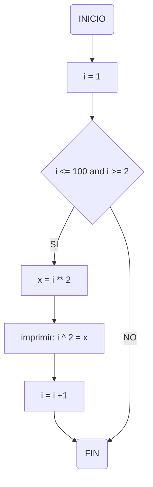
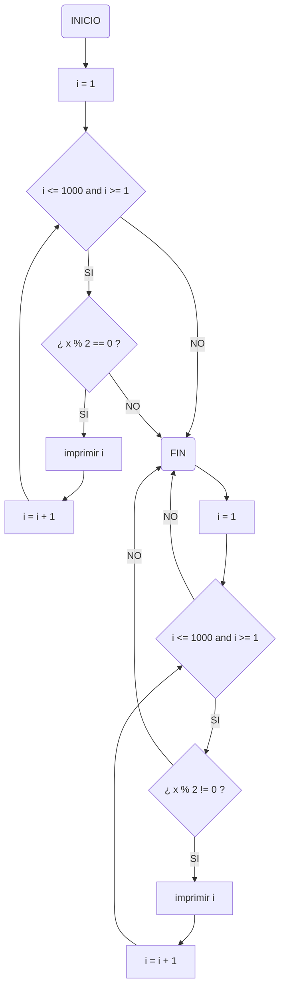
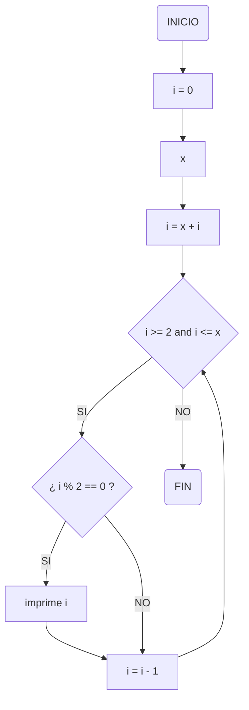

# reto_7_pdc

```mermaid
flowchart TD
A(INICIO)
B[i = 1]
C{i <= 100 and i >= 2}
D[x = i ** 2]
E[imprimir: i ^ 2 = x]
F[i = i +1]
G(FIN)
A --> B
B --> C
C --> |SI| D --> E --> F --> G
C --> |NO| G
```

```mermaid
flowchart TD
A(INICIO)
B[i = 1]
C{i <= 1000 and i >= 1}
D{¿ x % 2 == 0 ?}
E[imprimir i]
F[i = i + 1]
H[i = 1]
I{i <= 1000 and i >= 1}
J{¿ x % 2 != 0 ?}
K[imprimir i]
L[i = i + 1]
Z(FIN)

A-->B-->C-->|SI|D--> |SI|E-->F -->C
C-->|NO|Z
I-->|NO|Z
Z-->H-->I-->|SI|J-->|SI|K-->L --> I
D-->|NO|Z
J-->|NO|Z
```

```mermaid
flowchart TD
A(INICIO)
B[i = 0]
C[x]
D[i = x + i]
E{i >= 2 and i <= x}
G{¿ i % 2 == 0 ?}
H[imprime i]
I[i = i - 1]
Z(FIN)

A-->B-->C-->D-->E
E-->|SI|G
E-->|NO|Z
G-->|SI|H-->I-->E
G-->|NO|I
```
