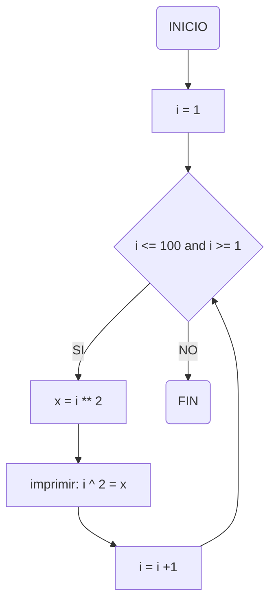

# Reto 7 - Bucles 1 (while)
### Soy Alejandro Bello y pertenezco al grupo de "Fenomenoides", adjunto nuestro logo: 

<details><summary>Preparense para ver el grandioso logo: </summary><p>
<div align='center'>
<figure> </br>
<figcaption><b> "somos programadores, no diseñadores" </b></figcaption></figure>
</div>
</p></details><br>

### 1. Imprimir un listado con los números del 1 al 100 cada uno con su respectivo cuadrado.
```python
i = 1
if __name__ == "__main__":
  while i > 0  and i <= 100:
      x = i ** 2
      print (f"{i} ^ 2 = {x}")
      i +=1
```
#### Diagrama de flujo: 

### 2. Imprimir un listado con los números impares desde 1 hasta 999 y seguidamente otro listado con los números pares desde 2 hasta 1000.
```python
i = 1
if __name__ == "__main__":
  while i <=1000 and i >=1:
      if i%2 != 0:
          print (i)
      i +=1
  
  i = 1
  while i <=1000 and i >=1:
      if i%2 == 0:
          print (i)
      i +=1
```
#### Diagrama de flujo:

### 3. Imprimir los números pares en forma descendente hasta 2 que son menores o iguales a un número natural n ≥ 2 dado
```python

i = 0
if __name__ == "__main__":
  x =int(input("Ingrese un numero para descomponerlo en numeros pares de forma descendente:  "))
  i = x + i
  while i >=2 and i <= x:
      if i % 2 == 0:
          print (i)
          i = i - 1
      else:
          i = i - 1
```
#### Diagrama de flujo:

### 4. En 2022 el país A tendrá una población de 25 millones de habitantes y el país B de 18.9 millones. Las tasas de crecimiento anual de la población serán de 2% y 3% respectivamente. Desarrollar un algoritmo para informar en que año la población del país B superará a la de A.
```python
A : int = 25000000 #poblacion inicial o "0" del pais A
B : int = 18900000 #poblacion inicial o "0" del pais B
i = 0 # Variable que muestra el año e inicia en 0 
if __name__ == "__main__":
  while A > B:
      #print (f"año {i}: {A}, {B}") # esta accion muestra la evolución cada año, pero no resalta el resultado final
      A += A *0.02
      B += B * 0.03
      i += 1
  print(f"Año {i}: A: {A}, B: {B}") #este es el año donde B superaría a A
```
### 5. Imprimir el factorial de un número natural n dado.
```python
i = 1 # Se asigna una variable que será el numero por el que se multiplica la variable iteradora
y = 1 # Se asigna una variable iteradora que empieza en 1
if __name__ == "__main__":
    x = int(input("numero: ")) #se ingresa el numero del cual se desea conocer el factorial
    while i <= x :
        y *= i
        i += 1 # a la variable iteradora se le va sumando 1 hasta que llegue al numero ingresado
    print (f"{i - 1}! = {y}")
```
### 6. Implementar un algoritmo que permita adivinar un número dado de 1 a 100, preguntando en cada caso si el número es mayor, menor o igual.
```python
import random # Se importa la libreria de random
num = random.randint(1, 100) # Se asigna un valor entero aleatorio dentro del rango esperado
bandera : bool = True # Se usa una bandera para entrar en el bucle
# print(num) # Se puede usar esta linea para verificar el numero aleatorio
if __name__ == "__main__":
    while bandera or x != num:
        bandera = False # Luego de entrar al ciclo, la bandera se "baja" y emieza a dar pistas para adivinar el numero
        x = int(input("Ingrese un numero entre 1 y 100 para tratar de adivinar: "))
        if x < num:
            print(f"el numero es mayor que {x}")
        elif x > num:
            print(f"el numero es menor que {x}")
    print(f"felicidades, el numero misterioso era: {num}")
```
### 7. Implementar un programa que ingrese un número de 2 a 50 y muestre sus divisores.
```python

i : int = 1 # Variable iteradora que prueba todos los divisores que pueda tener (divisor)
if __name__ == "__main__":
  x = int(input("Ingrese un numero entre 2 y 50 para mostrar sus divisores:  ")) # Se ingresa un numero dentro del rango para calcular sus divisores (dividendo)
    if x <= 50 and x >= 2: # mientras esta dentro del rango, evalúa que tenga divisores
        while i <= x:
            if x % i == 0: # Si es divisor del numero x, se muestra
                print(i)
                i += 1
            else:
                i += 1 " si no, solo actualiza el divisor
    else:
        print("no está dentro del rango esperado...") # retorna esto si no está dentro del rango...
```
### 8. Implementar el algoritmo que muestre los números primos del 1 al 100. Nota: use funciones
```python
max_prim : int = 100 # Se define una variable que es el límite numeros que se desea calcular si son primos
x : int = 2 # esta variable es el inicio desde donde se evalúa

def es_primo(x:int) -> bool: # Se define la función donde se evalúa si es un numero primo o no
  if x <= 1:
    return False
  i = 2 # se establece la variable iteradora (busca divisores exactos)
  while i <= (x ** 0.5): # solo buscamos hasta la raíz del numero (criba de erastotenes)
    if x % i == 0: # evalua si es par
      return False
    i += 1 # actualiza la variable iteradora
  return True # regresa True si no tiene divisores exactos hasta su raíz

if __name__ == "__main__":
  while x <= max_prim:
    if es_primo(x) == True:
      print (x)
      x += 1
    else:
      x += 1
```
